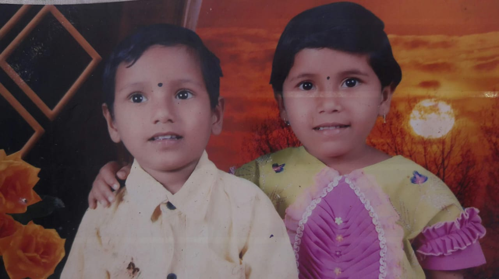

# Tai
<!DOCTYPE html>
<html lang="en">
<head>
    <meta charset="UTF-8">
    <meta name="viewport" content="width=<dsi>, initial-scale=1.0">
    <title>India</title>
</head>
<body>
    

    <h1 style="text-align: center;"> This is Information about Tai</h2>
    
    
 This is a GoodDay Biskuit. It is contains three Imgredient. Such as follows
        <ol>
            <li>Anger</li>
            <li>Gundagiri</li>
            <li>Small Brother La Marne <b></b>Hatkoon</b></li>
        </ol>
        

    

    
    
</body>
</html>

<!DOCTYPE html>
<html lang="en">
<head>
    <meta charset="UTF-8">
    <meta http-equiv="X-UA-Compatible" content="IE=edge">
    <meta name="viewport" content="width=device-width, initial-scale=1.0">
    <title>Tai</title>
</head>
<body>
    <h1 style="text-align: center;">SORRY SORRY TAI</h1>
    

        
        

            Dear Tai,

I just wanted to take a moment to let you know how much you mean to me. You are truly the best sister I could ever ask for. Your kindness, support, and the way you always have my back make me feel so incredibly lucky to have you in my life.

Whether we're laughing together, sharing memories, or even going through tough times, you always manage to make everything better. You have such a beautiful heart, and I admire your strength and generosity more than words can express.

Thank you for being the amazing person that you are. I love you more than you know, and I’m so grateful to be your sibling.

With all my love,
[Your Name]
        

    

</body>
</html>
